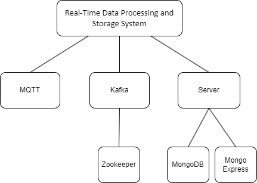
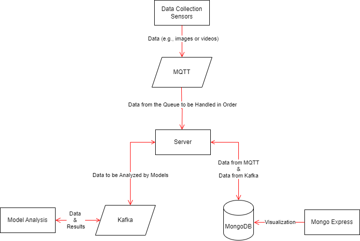
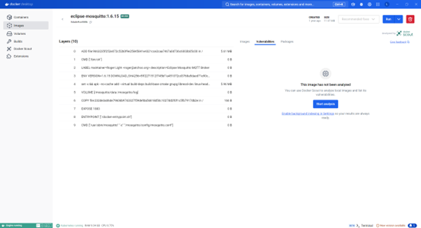
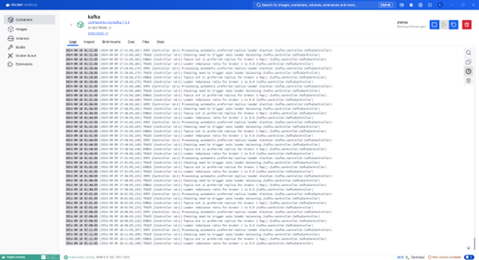
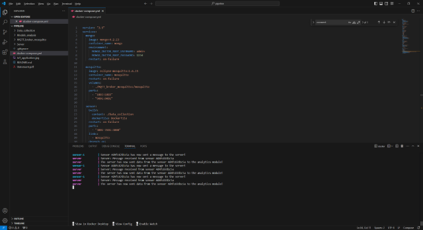
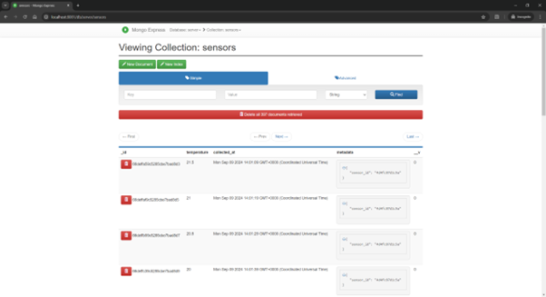

# Pipeline for Real-time Data Logistics Handling and Storage


## 1. How to run the application

### 1.1 Clone the repository

git clone https://github.com/Redback-Operations/redback-orion/tree/main/Player_Tracking/DataLogisticsPipeline

### 1.2 Locate the `docker-compose.yml` file is located. 


### 1.3 Execute the next command to run the application.

```bash
sudo docker compose up --scale sensor=1
```


### 1.4 How to communicate with the server

Currently, we simulate the real-time data by sending demo data regularly with sensor.js in Data_collection folder. 

```JavaScript
function main() {
    const mqtt = require('mqtt');
    // Connect to the message broker
    const client = mqtt.connect(
        {
            host: 'mosquitto',
            port: 1883
        }
    );

    // Read csv
    let collectedData = (require("fs").readFileSync("./demo_data.csv", "utf8")).split("\r");
    collectedData.shift();
    client.on('connect', () => {
        console.log('Sensor '+ process.env.HOSTNAME + ' is now connected to the MQTT broker');

        publishCollectedData(collectedData, 'Image', client);
    });
}
```

One can changes the demo data by reading from CSV file by some other data source to push data to our MQTT after the connection.


### 1.6 How to integrate existing models

One can update the model path to integrate models into the existing pipeline for data analysis and then add the data and analysis reults into MongoDB for further analysis, visualization or recording.


```Python
# Data Analysis for Crowd Monitering and Player Tracking
m = load(```Model Path```)
print("Starting Data Analysis")
for message in my_consumer:
    print("------------- Model Analysis -------------")
    print(f"Data {message} is being processed")
    message = message.value
    df_pred = pd.DataFrame.from_records([{"ds": message['ts']}])
    df_pred['ds'] = pd.to_datetime(df_pred['ds'])
    forecast = m.predict(df_pred)
    forecast['sensor'] = message['sensor']
    my_producer.send('analytics_results', value= forecast[['ds', 'yhat', 'yhat_lower', 'yhat_upper', 'sensor']].to_json(orient="index", date_format='iso'))
```


### 1.6 How to visualize existing data

Access the followign URL with browser to visualize existing data

```
http://localhost:8081/
```


## 2. Requirements

### 2.1 Introduction
The Real-Time Data Processing and Storage System aims to provide a robust and efficient solution for processing and storing data in real-time for the Crowd Monitoring and Player Tracking project. This document outlines the system architecture, components, features, deployment strategy, and interaction details for stakeholders and participants involved in the project.

### 2.2 Stakeholders
1) Project Team: Responsible for system development, deployment, and maintenance.

2) Data Analysts: Utilize processed data for insights and decision-making.

3) IT Administrators: Manage system infrastructure and configuration.

4) End Users: Interact with the system to access real-time data.

### 2.3 System Overview
1) Frontend Interface: Allows users to interact with the system.

2) Backend Services: Includes MongoDB Container, Kafka Container, Data Processing Layer, and Storage Layer.

3) Real-Time Processing Layer: Handles incoming data streams for processing.

4) Communication Layer: Facilitates communication between system components.

### 2.4 Features
1) Real-Time Data Ingestion: Accepts and processes incoming data streams.

2) Data Storage: Stores processed data in MongoDB.

3) Event Streaming: Utilizes Kafka for real-time event streaming.

4) Data Processing: Analyzes and processes data based on predefined algorithms.

5) Monitoring and Alerts: Provides monitoring capabilities and alerts for system health.


### 2.5 Deployment
The system will be deployed using Docker containers for MongoDB and Kafka. Detailed deployment instructions will be provided to stakeholders for easy setup and maintenance. Continuous monitoring and logging will be implemented to ensure system stability and performance.

### 2.6 Challenges Faced and Solutions

1) Configuration Issues: Addressed by refining Docker container configurations and port mappings.

2) Performance Optimization: Implemented optimizations in data processing algorithms for increased efficiency.

3) Error Handling: Enhanced error handling mechanisms for better fault tolerance and system reliability.

### 2.7 Future Enhancements

1) Scalability: Implement mechanisms for horizontal scaling to handle increased data load.

2) Security Enhancements: Introduce encryption and authentication measures to secure data transmission.

3) Integration with AI Models: Incorporate machine learning models for advanced data analysis.


## 3. Design
### 3.1 Architecture


### 3.2 Services
#### 3.2.1 MongoDB Service

The MongoDB service is created using the official MongoDB image. It is crucial for data storage within the system. By defining the root username and password in the environment variables, the service ensures secure access to the database. MongoDB acts as the primary data repository where information collected by the sensor service and processed by the server service is stored for further analysis and retrieval.


#### 3.2.2 MQTT Service

The MQTT service utilizes the Eclipse Mosquitto image to establish an MQTT broker. This component is essential for handling messaging within the system. By setting up volumes and ports, the service facilitates communication between various components by enabling the exchange of real-time data streams. Mosquitto serves as the messaging backbone, allowing seamless interaction between different services.


#### 3.2.3 Server Service

The server service, constructed from a Dockerfile in the Server context, acts as the core processing unit within the system. By linking to Mosquitto, MongoDB, and Kafka, it establishes connections to key components for data processing and analysis. The server service processes incoming data streams, conducts real-time analytics, and stores results in the MongoDB database. It serves as the central hub for data manipulation and decision-making.


#### 3.2.4 Mongo Service

MongoDB Express Service provides a user-friendly web interface for managing the MongoDB database. By configuring the connection settings to the MongoDB service, it allows users to interact with the database visually. This service simplifies database management tasks such as querying, updating, and deleting data, providing a convenient way to monitor and administer the stored information.


#### 3.2.5 Kafka Service
The Kafka service, based on the Confluent Kafka image, enables real-time data streaming and processing. By connecting to Zookeeper for coordination, Kafka establishes a robust messaging system for handling data streams efficiently. With defined environment variables and port mappings, Kafka ensures high-throughput data transfer and fault-tolerant message processing, supporting the real-time analytics and decision-making processes within the system.


#### 3.2.6 Zookeeper Service
Zookeeper, deployed using the Confluent Zookeeper image, serves as the distributed coordination platform for the system. By defining specific environment variables and ports, Zookeeper ensures seamless communication and synchronization among the various services. It plays a pivotal role in maintaining consistency and managing distributed resources across the system.


#### 3.2.7 Sensor Service (for simulation)
The sensor service is built from a custom Dockerfile within the Data_collection context. It is responsible for collecting real-time data from sensors and devices. By linking to the MQTT service, the sensor service can publish data to specific MQTT topics for consumption by other services. This component plays a vital role in the initial data acquisition stage of the system.


#### 3.2.8 Model Analysis Service(for simulation)
The model analysis service, built from a Dockerfile in the Models_analysis context, focuses on data analysis and modeling tasks. By depending on Kafka for data ingestion and processing, this service is dedicated to running complex algorithms, statistical models, and machine learning processes on the incoming data streams. It plays a critical role in extracting insights and patterns from the real-time data for decision support.


## 4. Relationships of Service
### 4.1 Flow Chart



### 4.2 Sequence Diagram


The relationships between the services in the Real-time Data Processing and Storage System are crucial for seamless operation and data flow.


### 4.3 Between Sensor Service and MQTT Service

The sensor service publishes data to MQTT topics on the Mosquitto broker, enabling other services to subscribe to and process the incoming data streams.


### 4.4 Between Server Service and MQTT, MongoDB, Kafka Services

The server service connects to Mosquitto for data ingestion, MongoDB for data storage, and Kafka for real-time data streaming and processing. It acts as the central processing unit that orchestrates data flow between these services.

### 4.5 Between Model Analysis Service and Kafka Service

The model analysis service relies on Kafka for receiving real-time data streams, processing them through analytical models, and generating insights. Kafka serves as the messaging backbone for data exchange between the model analysis service and other components.

### 4.6 Between Mongo Express Service and MongoDB Service

MongoDB Express interfaces with the MongoDB service, providing a visual management tool for interacting with the database. It enhances the usability and accessibility of the MongoDB database for administrators and users.

### 4.7 Between Kafka Service and Zookeeper Service
Kafka depends on Zookeeper for distributed coordination and management of topics, partitions, and offsets. Zookeeper ensures the reliability and consistency of Kafka's messaging system, facilitating seamless data streaming and processing.


## 5. Implementation Results and Demonstration
 
  
 
  
 
  
 
  
 
  
 
 
 
  
 
 	
 ## 6. Reference

  [1] https://mqtt.org/

  [2] https://hub.docker.com/_/eclipse-mosquitto

  [3] https://github.com/eclipse/mosquitto

  [4] https://kafka.apache.org/

  [5] https://github.com/apache/kafka

  [6] https://hub.docker.com/r/apache/kafka

  [7] https://www.mongodb.com/
  
  [8] https://github.com/mongodb/mongo

  [9] https://hub.docker.com/_/mongo

  [10] https://github.com/sergio11/iot_event_streaming_architecture

